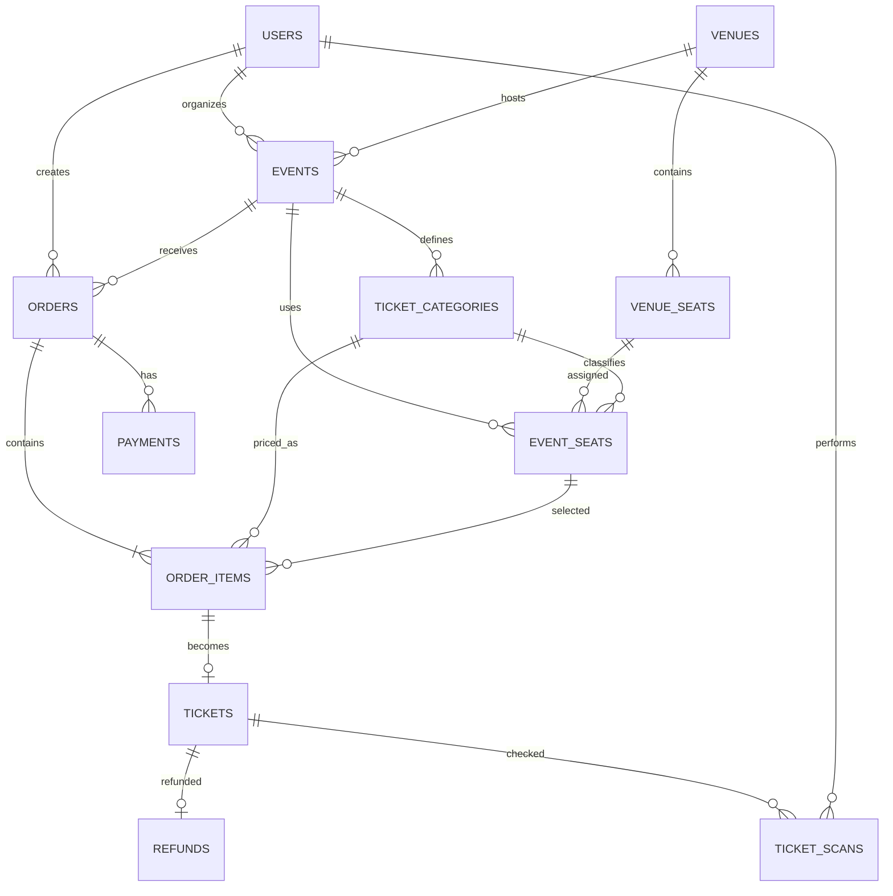

# ER-диаграмма логической модели

```mermaid
erDiagram
    USERS ||--o{ EVENTS : organizes
    VENUES ||--o{ EVENTS : hosts
    VENUES ||--o{ VENUE_SEATS : contains
    EVENTS ||--o{ TICKET_CATEGORIES : defines
    EVENTS ||--o{ EVENT_SEATS : uses
    VENUE_SEATS ||--o{ EVENT_SEATS : assigned
    TICKET_CATEGORIES ||--o{ EVENT_SEATS : classifies
    USERS ||--o{ ORDERS : creates
    EVENTS ||--o{ ORDERS : receives
    ORDERS ||--|{ ORDER_ITEMS : contains
    ORDER_ITEMS ||--o| TICKETS : becomes
    TICKET_CATEGORIES ||--o{ ORDER_ITEMS : priced_as
    EVENT_SEATS ||--o{ ORDER_ITEMS : selected
    ORDERS ||--o{ PAYMENTS : has
    TICKETS ||--o| REFUNDS : refunded
    TICKETS ||--o{ TICKET_SCANS : checked
    USERS ||--o{ TICKET_SCANS : performs
```

`EVENT_SEATS` реализует связь M:N между мероприятием и физическими местами и одновременно позволяет назначить категорию цены конкретному месту.
